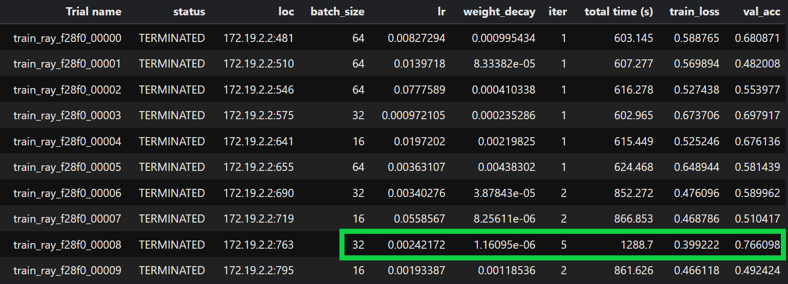
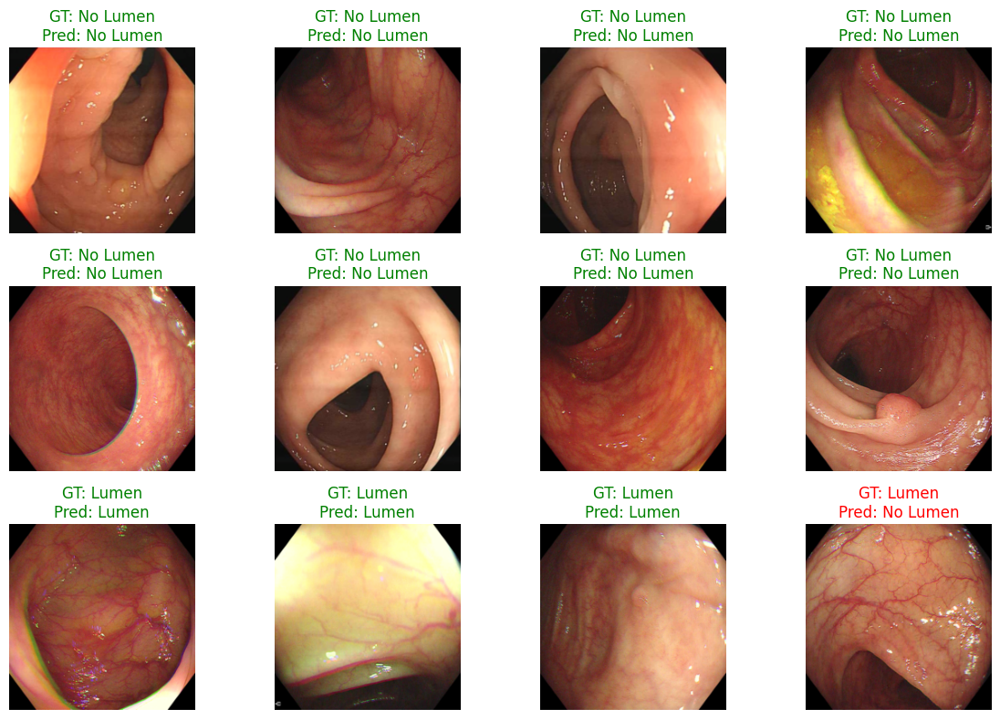
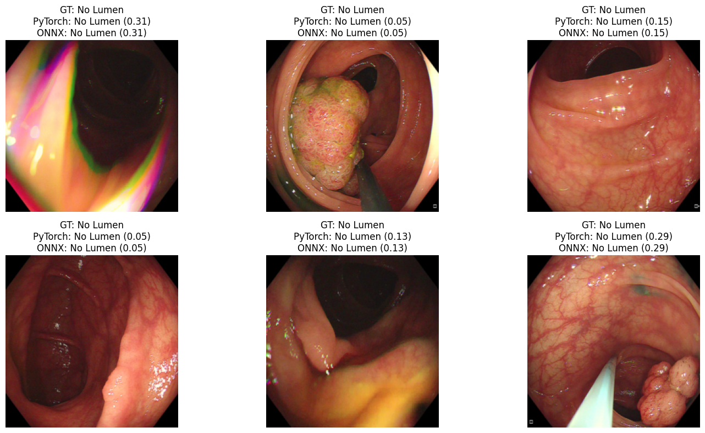
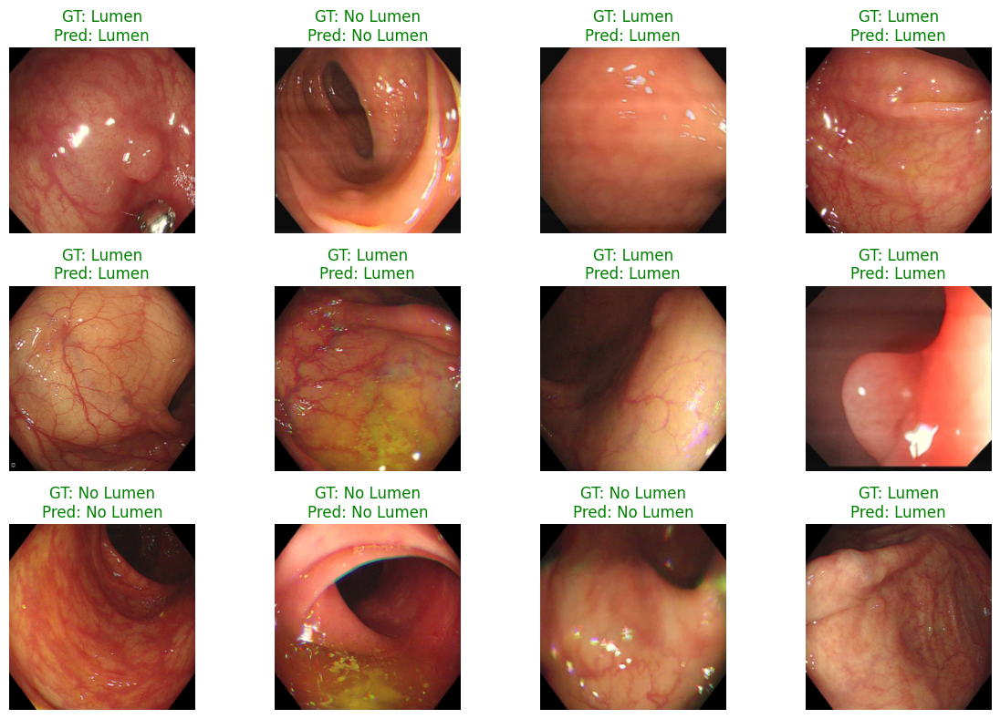

# Lumen Detection

Lumen detection in colonoscopy images refers to the identification and location of the central region of the intestinal tract (lumens) in colonoscopy images. This is done to correct guidance, improve the quality of imaging, and
It is very important to avoid navigational errors. Also, accurate detection of lumens can be effective in increasing the accuracy of lesion detection and improving the segmentation of polyps.

In this repo, we represent our work on colonoscopy images by light weight models 
as binary classifiers

*Due to confidentiality matters, we are unable to share data set directly here.
If you need the acces contact any of us:
*
(Arman Yazdani)[]

## SqueezeNet
We trained **SqueezeNet v1.1** from scratch with a custom lightweight classification head:

- Final classifier:  
  `Conv2D(512 → 32) → BatchNorm → ReLU → AdaptiveAvgPool2d → Linear(32 → 1)`
- Output is passed to `BCEWithLogitsLoss` for binary classification.
- Trainable params: `739,009`
<p align="center">
    
</p>


## MobileNetV3small

We Fine-tuned MobileNetV3 Small, a lightweight convolutional neural network, pre-trained on ImageNet and fine-tuned for our binary classification task. Final layer adapted to output a single logit → Binary classification with BCEWithLogitsLoss

*   **Model:** MobileNet V3 small
*   **Weights:** Pretrained
*   **Trainable params:** `1,518,881`
*   **Loss Function:** BCEWithLogitsLoss for binary output
*   **Optimizer:**
    -  Adam optimizer with learning rate 1e-4
    -  Learning rate scheduling using ReduceLROnPlateau
    -  Early stopping based on validation loss
<p align="center">
    
</p>

## Gradio UI 😊

We also prepaired a user friendly interface where you can uplaod your colonoscpy image or data set and see our models inference
<p align="center">
    
</p>


Here's how to use it on your local host:
```bash
git clone https://github.com/theveryhim/Lumen-Detection.git your-directory
cd ...\your-directory\Lumen-Detection
python app.py
```
then follow to the given link and tadaa!


# Lumen detection+
Here we try to Improve our models to their best performance for lumen detection through systematic optimization and new training techniques. Further more, We focus on balancing accuracy with computational efficiency for practical deployment.
## SqueezeNet
Let's continue with the smaller/faster model!
### Hyperparameter Optimization: Ray
Used Ray Tune with ASHA scheduler for Bayesian optimization. Searched loguniform spaces for `lr (1e-4 to 1e-1)`, `weight_decay (1e-6 to 1e-2)`, and `batch_size [16,32,64]`. Maximized `val_acc` over 10 trials.
<p align="center">
    
    <figcaption> Hyperparameter optimization with Ray</figcaption>
</p>

### Training: Curriculum Learning
Our strategy combines a fixed curriculum of **Progressive Data Deblurring** with the **MixUp** regularization technique, executed using the previously optimized hyperparameters.
<p align="center">
    
    <figcaption> Enahnced models performance</figcaption>
</p>

### Production Prototype: ONNX
- Exported optimized models to ONNX format for production deployment.
<p align="center">
    
    <figcaption> ONNX/Enhanced models performance</figcaption>
</p>

```markdown
Avg PyTorch inference time per batch: 98.930 ms
Avg ONNXRuntime inference time per batch: 20.431 ms
```

- Employed quantization techniques for potential edge deployment scenarios.
```markdown
PyTorch int8 inference time per batch (CPU): 103.658 ms
ONNX int8 inference time per batch: 55.911 ms
```
```markdown
Evaluating models...
PyTorch INT8 Accuracy: 0.8627, F1_torch: 0.8574, AUC_torch: 0.8625
ONNX INT8 Accuracy: 0.8513, F1_onnx: 0.8465, AUC_onnx: 0.8513
```
## MobileNetV3small
In this phase, we've done below tasks:

1. Realistic colonoscopy-specific augmentations:

| Augmentation Type | Purpose                                                |
| ----------------- | ------------------------------------------------------ |
| **Geometric**     | Simulate camera movements (flip, rotate, affine, zoom) |
| **Photometric**   | Adjust brightness, contrast, saturation, hue           |
| **Noise & Blur**  | Simulate real-world motion blur and camera noise       |

   
3. Systematic hyperparameter search for stable training:

   Used Ray Tune with ASHA scheduler for Bayesian optimization.
    BCE Loss:
   
    search_space = {
    "lr": tune.loguniform(1e-5, 1e-3),
    "batch_size": tune.choice([16, 32, 64]),
    "optimizer": tune.choice(["AdamW", "SGD"]),
    "weight_decay": tune.loguniform(1e-6, 1e-2),
    "momentum": tune.uniform(0.8, 0.99)
    }
   
    Focal Loss:
   
    search_space = {
        "gamma": tune.uniform(0.0, 4.0),
        "lr": tune.loguniform(1e-5, 1e-3),
        "weight_decay": tune.loguniform(1e-6, 1e-3),
        "batch_size": tune.choice([8, 16, 32]),
        "optimizer": tune.choice(["adam", "adamw", "sgd"]),
        "momentum": tune.uniform(0.5, 0.99)  
    }
      
5. Loss function comparison:
   
    BCE Loss – standard binary classification.
    Focal Loss (α=0.5) – emphasizes hard-to-classify samples.
   
6. Hard example mining to focus on difficult cases.

The overall workflow:


### Results: BCE vs. Focal Loss
The comparison was conducted over 20 training epochs with the same dataset, augmentation pipeline, and hyperparameter tuning workflow.

| Hyperparameter | BCE Best Value | Focal Loss Best Value |
| -------------- | -------------- | --------------------- |
| Learning Rate  | 0.0002997      | 0.00003432            |
| Weight Decay   | 5.16e-05       | 1.03e-04              |
| Batch Size     | 16             | 16                    |
| Optimizer      | AdamW          | AdamW                 |
| Momentum       | —              | —                     |
| Focal Gamma    | —              | 0.8724                |

#### Training and Validation Curves

Loss Curves: Focal Loss converges faster and achieves a lower final loss, indicating better handling of challenging samples.

Accuracy Curves: Both models surpassed 94% accuracy on validation data. Final accuracy was similar, suggesting that Focal Loss improves robustness rather than raw accuracy.


#### Classification Metrics on Test Set
Focal Loss matches BCE for lumen detection while focusing on hard cases, which is crucial in clinical settings.

| **Loss Function**   | **Accuracy** | **Class** | **Precision** | **Recall** | **F1-Score** |
| ------------------- | ------------ | --------- | ------------- | ---------- | ------------ |
| **BCE**             | **0.94**     | lumen     | 0.93          | 0.95       | 0.94         |
|                     |              | no-lumen  | 0.95          | 0.95       | 0.94         |
| **Focal (α = 0.5)** | **0.94**     | lumen     | 0.93          | 0.95       | 0.94         |
|                     |              | no-lumen  | 0.95          | 0.92       | 0.93         |

#### Grad-CAM Visualization
Focal Loss encourages the model to attend to subtle, challenging features that are often missed by BCE.


#### Hard Example Evaluation
1. Reduction of Dangerous Errors:

Focal Loss reduced high-confidence incorrect predictions by ~33%.

These are the most critical errors in medical imaging since the model is confident but wrong, which could mislead clinicians.

2. Improved Calibration:

Focal Loss pushes predictions closer to the 0.5 boundary for uncertain cases.

This creates a well-calibrated model:

High confidence → usually correct

Low confidence → indicates uncertainty

BCE, by contrast, tends to overfit, producing overly confident predictions even when incorrect.

3. Model "Knows What It Doesn't Know":

Focal Loss improves the model’s awareness of uncertainty, a hallmark of reliable AI in healthcare.

| **Hard Example Type**           | **BCE** | **Focal Loss** |
| ------------------------------- | ------- | -------------- |
| Misclassified count             | 64      | 68             |
| Low-confidence correct count    | 31      | **74**         |
| High-confidence incorrect count | 33      | **22**         |
| Borderline count                | 88      | **175**        |


### A Bigger Stride: Knowledge Distillation
Leveraged MobileNetV3 teacher to enhance SqueezeNet student performance. Combined hard and soft loss for effective knowledge transfer.
<p align="center">
    
    <figcaption> Student(SqueezeNet) model's performance after knowledge distillation</figcaption>
</p>

```markdown
Test Accuracy: 0.8738, F1: 0.8501, AUC: 0.9291
```
