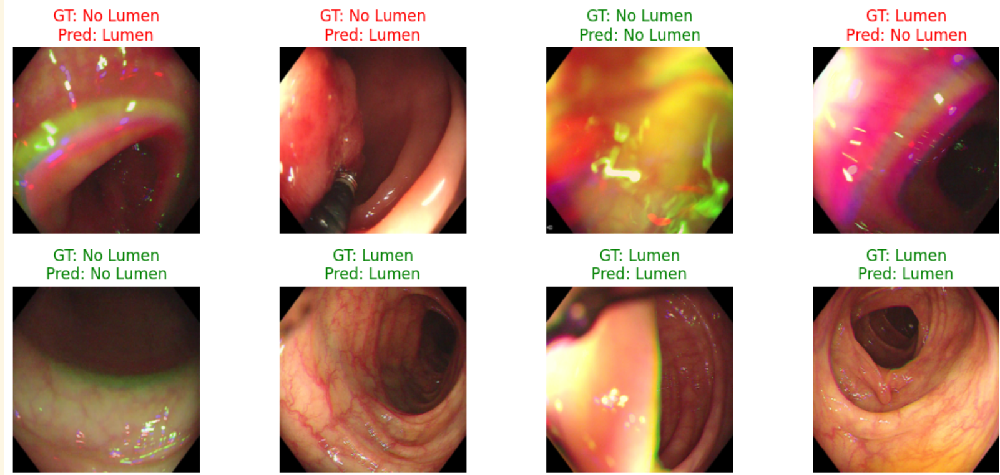
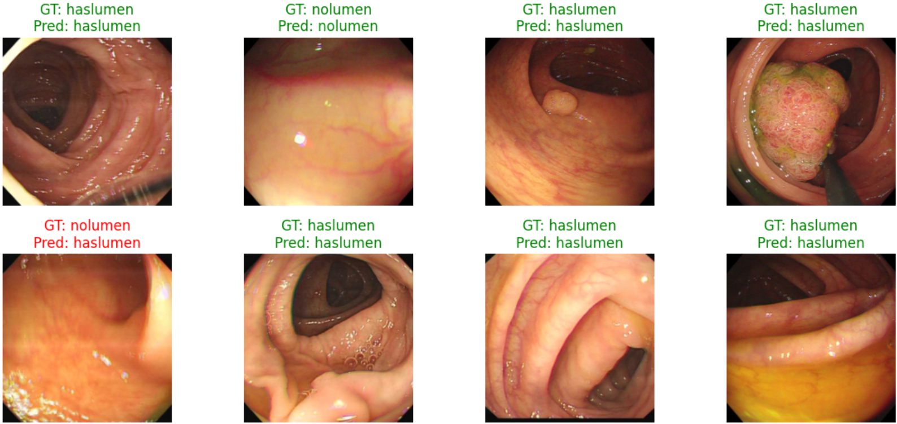
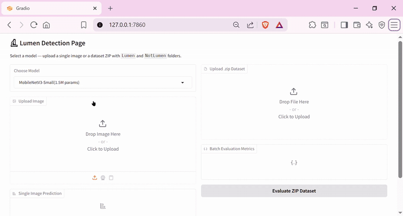

# Lumen Detection

Lumen detection in colonoscopy images refers to the identification and location of the central region of the intestinal tract (lumens) in colonoscopy images. This is done to correct guidance, improve the quality of imaging, and
It is very important to avoid navigational errors. Also, accurate detection of lumens can be effective in increasing the accuracy of lesion detection and improving the segmentation of polyps.

In this repo, we represent our work on colonoscopy images by light weight models 
as binary classiffiers

⚠️ Due to confidentiality matters, we are unable to share data set directly here.<br>
If you need the access, contact any of us:<br>
Arman Yazdani: [📧](mailto:m.arman.yazdani@gmail.com)<br>
Fatemeh Shariftabaar: [📧](mailto:fatemeh.shariftabarazizi@gmail.com) 

## SqueezeNet []([https://colab.research.google.com/drive/your-notebook-id](https://colab.research.google.com/drive/1enJLc6_0KPY9EWcCQ5s7SlWT1Hf_LPSj#scrollTo=UXBwzRPCvT3r))
We trained **SqueezeNet v1.1** from scratch with a custom lightweight classification head:

- Final classifier:  
  `Conv2D(512 → 32) → BatchNorm → ReLU → AdaptiveAvgPool2d → Linear(32 → 1)`
- Output is passed to `BCEWithLogitsLoss` for binary classification.
- Trainable params: `739,009`
<p align="center">
    
</p>


## MobileNetV3small []([https://colab.research.google.com/drive/your-notebook-id](https://colab.research.google.com/drive/1-iH35mfEr0HoMwtR-Y0k9UIpGQg7-Gmt#scrollTo=tNgwEdqjDevi))

We Fine-tuned MobileNetV3 Small, a lightweight convolutional neural network, pre-trained on ImageNet and fine-tuned for our binary classification task. Final layer adapted to output a single logit → Binary classification with BCEWithLogitsLoss

*   **Model:** MobileNet V3 small
*   **Weights:** Pretrained
*   **Trainable params:** `1,518,881`
*   **Loss Function:** BCEWithLogitsLoss for binary output
*   **Optimizer:**
    -  Adam optimizer with learning rate 1e-4
    -  Learning rate scheduling using ReduceLROnPlateau
    -  Early stopping based on validation loss
<p align="center">
    
</p>

## Gradio UI 😊

We also prepaired a user friendly interface where you can uplaod your colonoscpy image or data set and see our models inference
<p align="center">
    
</p>


Here's how to use it on your local host:
```bash
git clone https://github.com/theveryhim/Lumen-Detection.git your-directory
cd ...\your-directory\Lumen-Detection
python app.py
```
then follow to the given link and tadaa!
